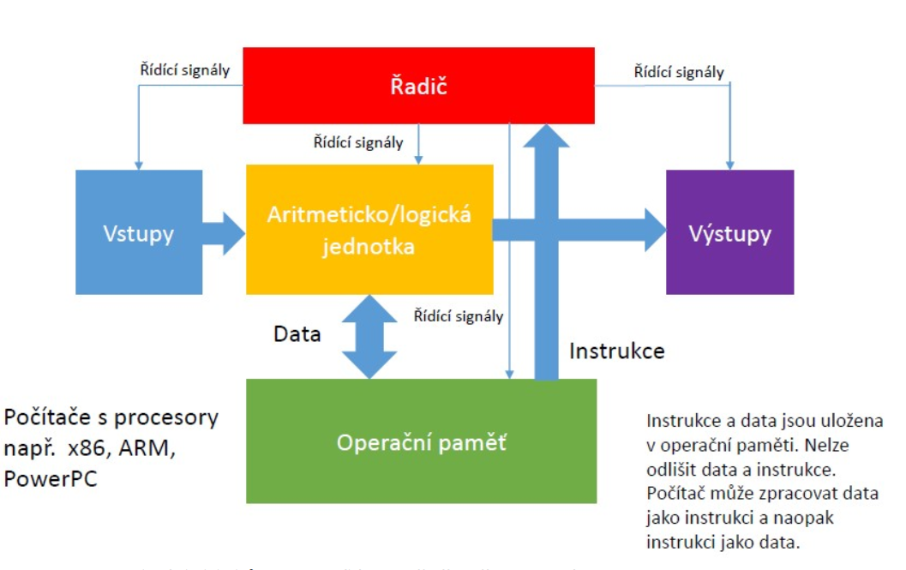
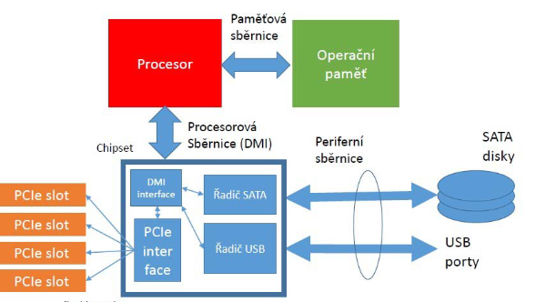
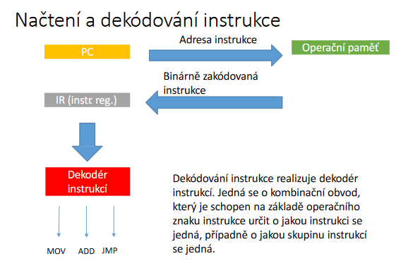

# Architektura procesorů

### Od automatu k RISC architektuře

- Z počátku byly počítače specializované na určité výpočty a daly se přeprogramovat pouze změnou zapojení - automaty
- Koncept Johna Von Neumanna položil základ pro univerzální programovatelné stroje. Díky tomuto konceptu vznikl procesor, který vykonává zadaný program

## Von Neumannova architektura

- Nejvyšší úroveň abstrakce
- **vstupy/výstupy** - periferie
- **ALU** - kombinační obvod pro nejduležitější operace
- **Řadič** - sekvenční obvod, který generují řídící signály pro ostatní bloky
    - řídí přenosy po sběrnicích
    - dekoduje instrukce a generuje příslušné řídící signály
    - data jsou rovněž uložena v operační paměti a nelze rozpoznat zda jsou to data nebo intrukce
## Harvardská architektura

#### **Paměť programu**
- typ flash
- instrukce a konstanty v programu jsou uchovány i době vypnutí
#### **Paměť dat**
- statická RAM
- data se ztratí po vypnutí
#### **obecně**
- Každá paměť může mít jinou velikost nejmenší adresovací jednotky  
- program nemůže přepsat sám sebe
- Dvě sběrnice umožňují jednoduchý paralelizmus kdy lze přistupovat pro instrukce i data současně
- příklad **ESP82668**
## Architektura současného počítače

#### **Různé sběrnice podle účelu**
- obsahují adresy, data. řídící a stavové signály, jsou specificky definované. mají různé protokoly a časování

#### **Procesor implementuje stále vetší čast**
- integruje řadič operační paměti - dříve north bridge chipsetu základní desky

#### **Paměťová sběrnice**
- Direct media interface
- Chipset zajišťuje komunikaci mezi periferiemi a procesorem pomocí rozšiřujících a periferních sběrnic

## Řadič procesoru
- Realzuje instrukční cyklus
- Řídí vykonávání dílčích operací v rámci instrukčního cyklu
- generuje řídící signály
- Reaguje na stavové signály
    - Přerušení
- Realizace
    - Obvodový řadič
        - konečný automat
        - D-flip flop + kombinační logika
    - Mikroprogramový řadič
        - ralizuje složitější instrukce
        - má paměť pro uložení mikroinstrukcí
        - instrukce procesoru je realizována vykonáním sady mikroinstrukcí

## Instrukční cyklus počítače
- IF
    - načtení instrukce
- ID
    - dekódování instrukce
- OF
    - načtení operandů
- EX
    - vykonání instrukce
- WB
    - zapsání výsledku
- Interrupt detection
    - přerušení
 
 

