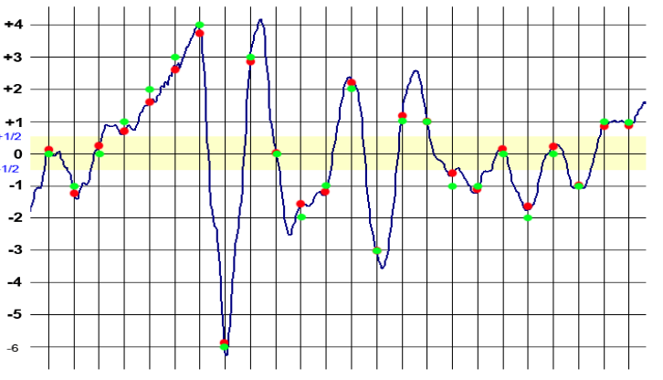

# Zvukový podsystém PC
## Zvuková karta
- rozšiřující karta počítače pro vstup a výstup zvukového signálu ovládaná softwarově
- Typická karta obsahuje zvukový čip
    - provádí digitálně-analogový převod nahraného nebo vygenerovaného digitálního signálu
- Tento signál je převeden na výstup
    - většinou 3,5mm jack
- Má také **line in** konektor
    - lze připojet kazetový přehrávač nebo podobný zdroj zvukového signálu
    - Zvuková karta může digitalizovat tento signál a uloží je na úložistě dat
    - **Digitalizace** se provádí pomocí vzorkování
- Třetí konektor bývá **mikrofon**
    - signál z něj je možné nahrávat na úložiště dat nebo ho jinak zpracovat
        - rozpoznávání hlasu či VoIP

### Vzorkování analogového signálu

- Analogový signál protíná v čase vzorkování úrovně signálu vyznačené červenými body
- jsou v převodníku kvantovány na zelené body, odpovídající nejbližšímu číselnému vyjádření

- Aby bylo možno zaznamenat analogový signál je nutné hodnoty v daných časových intervalech převést na čísla
- Volí se vhodný počet bitů jednotlivých vzorků v závislosti na vzorkovací frekvenci
    - např. Audio CD 16 bitů a frekvenci 44 100 Hz
- Jedna perioda potřebuje minimálně dva vzorky pro zobrazení kladné a záporné půlvlny
    - proto musí být vzorkovací frekvence dvojnásobná než frekvence přenášející
- **Shannonův-Nyquitův-Kotělnikův teorém**
    - Přesná rekonstrukce, frekvenčně omezeného signálu z jeho vzorků je možná tehdy, pokud byla vzorkovací frekvence vyšší než dvojnásobek nejvyšší harmonické složky vzorkovaného signálu

### Audiokodeky

- **bezeztrátové**
    - **WAV**
        - Zvukový formát Waveform audioformat
        - Vytvořili firmy Microsoft a IBM pro ukládání zvuku na PC
    - Kontejner obsahuje nekomprimovaný jedno nebo vícekanálový zvuk kódovaný  pomocí pulzně kódové modulace s lineárním kvantováním LPCM
- **Ztrátové**
    - Nelze po komresi znovu rekonstruovat původní signál
    - MPEG layer 1 až 3
    - AC3
    - AAC
    - WMA
## Mikrofony
- je zařízení pro přeměnu akustického signálu na elektrický

### Kondenzátorový mikrofon
- Akustické vlny rozchvívají membránu
    - je to jedna z elekrod kondenzátoru připojeného do elektrického obvodu
- V rytmu změny polohy se mění kapacita v kondenzatoru
- Jsou považovány za nejkvalitnější mikrofony
    - používají se pro studiový a profesionální záznam
- také se vyrábějí pro měřící účely

### Elektretový mikrofon
- Je to typ kondenzátorového mikrofonu u něhož je elekrické pole nezbytné
- V rytmu pohybu membrány se mění kapacita kondenzatoru a tím i napětí mezi deskami
- Změny napětí musí být zpracovány předzesilovačem s vysokou vstupní impedancí.
- Používá se u počítaču, telefonů, diktafonech
- výhoda je jednoduchá konstrukce a malé rozměry

### Piezoelektrický mikrofon
- pracuje na piezoelektrickém jevu
    - stlačováním či ohybem některých materiálů vznikne napětí
- nebyly tak kvalitní

### Membránový mikrofon
- Membrána pohybuje cívkou v magnetickém poli vytvořené permanentním magnetem
- jsou méně citlivé proto lépe zpracují hlasitý zpěv na živých vystopeních
- odolné vůči poškození

## Reproduktor
- jsou to elektro akustické měniče
- převádí elektrickou energii na akustickou
- Obvykle se skládají z membrány a z pohonné části
### Elektrodynamický reproduktor
- nejběžnější
- základem je cívka a permanentní magnet
    - cívka se pohybuje ve válcové štěrbině mezi pólovými nástavci magnetického obvodu
