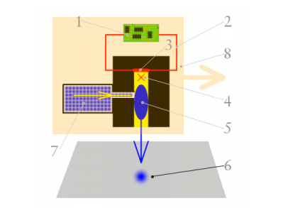
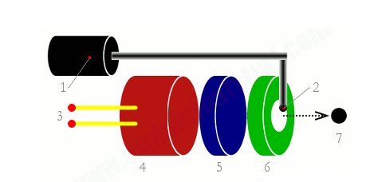
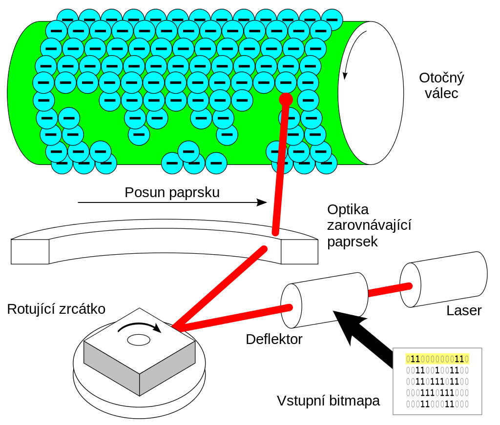

# Tiskárny
## Jehličkové
- Tiskárna má 9 nebo až 24 **jehliček v matici**
- Jehličky poté začnou narážet přes **barvící pásku** do papíru
- Používá k tisku **tiskovou hlavu**, která se pohybuje ze strany na stranu po listu papíru
- Také se pohybuje přes barvící pásku naplněnou inkoustem
    - jehličky otisknou na papír
- **Výhoda:**
    - velice nízké náklady 
    - jsou schopné díky jehličkám tiskout více kopií najednou
        - Dokáže tisknout přes více vstev papíru
    - moderní tiskárny mají velice nízkou poruchovost
    - je kompaktní
    - Rychlost až 680 znaků za sekundu
        - A4 cca za 3 sekundy
- **Nevýhoda:**
    - nejsou vhodné pro tisk komplikovanější grafiky
        - Nižší kvalita tisku
        - Vysoká hlučnost
- **Vhodné pro:**
    - Tisk štítků
    - Firemních dokumentů
    - Tisk účetních dokladů
## Inkoustové
- Snaží se nahradit nekvalitní tisk jehličkových tiskáren
- V tiskové hlavě se nachází stovky miniaturních trysek vstřikující inkoust na papír
- **Nevýhoda:**
    - Inkoust bývá drahý
    - Z trysek často pomalu vytéká inkoust na dno tiskárny
        - ucpává trysky
    - Je pomalý tisk
    - Inkoust je rozpustitelný ve vodě
    - Vybledne
### **Termální inkoustový tisk**
- Inkoust je zahříván
    - vzniká mikroskopická bublinka barvy
- inkoust vystřelí na papír
- Jedná se o nejrozšířenější typ

- **Postup**
    1. Počítač pošle tiskárně instrukce k tomu, které trysky je potřeba aktivovat při tisku, aby byl vytištěn konkrétní znak nebo obraz na určeném místě stránky. Na tisku jediného písmena se podílí stovky trysek, z nichž každá z nich má průměr jen o málo větší než lidský vlas.
    2. Tiskárna aktivuje konkrétní trysky průchodem elektrického proudu skrz rezistory, které jsou součástí trysek.
    3. Průchodem elektrického proudu rezistorem se součástka zahřeje.
    4. Rezistor začne zahřívat inkoust v přilehlé trysce.
    5. Jak se inkoust zahřívá, začne se tvořit bublina, která se teplem neustále zvětšuje, až praskne.
    6. Tím se přenese na stránku miniaturní přesně vytvarovaný puntík barvy.
    7. Prasknutím inkoustové bubliny vznikne podtlak, který natáhne do trysky další kapku inkoustu ze zásobníku barvy.
    8. Mezitím se celá tisková hlava posouvá dále po řádku, aby mohlo dojít k vytištění dalšího písmene nebo části obrazu tištěného dokumentu.
### **Piezoelektrický tisk**

- **Postup**
    1. Miniaturní množství inkoustu je nataženo tenkou trubičkou ze zásobníku (cartridge) do rezervoáru inkoustu, který se je součástí každé trysky.
    2. Kapka inkoustu je zachycena na samém okraji trysky a čeká, až bude doslova katapultována na papír.
    3. Elektrický obvod tiskárny dodá energii elektrickým kontaktům, které ji předají piezoelektrickému krystalu.
    4. Ten se po přijetí energie prudce roztáhne a skrz tenkou membránu vymrští kapku inkoustu na papír.
## Laserové
- Laserový paprsek vykresluje obrázek na světlocitlivý válec
    - na jehož povrch se poté nanáší toner
- Uchytí se jen na osvětlených místech a je tepelně fiksován
- mechanický stěrač setře zbytky toneru a žárovka odstraní náboj z předchozí fáze
- Papír se pod vílec dostane ze vstupního zásobníku a je nabit opačným nábojem než toner

- **Výhody**
    - Vysoká kvalita
    - rychlý tisk
    - nízké náklady
    - nízká hlučnost
- **Nevýhody**
    - Vyšší pořizovací cena
    - musí se nahřát před tiskem
    - není vhodná na tisk fotografií
# Barevné modely
- je to matematický model popisující barvy na základě jednotlivých složek
## RGB
- je to aditivní barevný model
    - jednotlivé složky se sčítají a výsledek je světlo větší intenzity
    - všechny barvy dohromady = bílá
- Skládá se z ČERVENÉ, ZELENÉ A MODRÉ
- je založen na tom, že oko takto vnímá barvy
- Monitory používají RGB
## CMYK
- je to subtraktivní barevný model
    - Jednotlivé složky se odečítají a světlo se stále více pohlcováno
    - všechny barvy dohromady = černá
- Skládá se z CYAN, MAGENTA, YELLOW a navíc KEY BLACK
- používá se hlavně na tisk protože papír je bílý
- Černá je přidána aby se ušetřili náklady na tisk

# Tiskové jazyky
## POSTSCRIPT
- je programovací jazyk určený k grafickému popisu tisknutelných dokumentů
- vyvinut firmou **Adobe**
- výhodou je nezávislost na zařízení
- je považován za standard pro dražší tiskárny
- Díky rozsáhlým možnostem se stal i formátem k ukládání obrázků
- přípona je .ps
## PCL 
- PRINTER COMMAND LANGUAGE
- jde o jazyk tiskových příkazů HP
    - deskjet, laserjet
- PCL je jazyk pro práci s techtem a grafikou

# DPI a CPI
- DPI = počet bodů na palec
    - je používán v tiskárnách
    - čím více DPI tím kvalitnější tisk
- CPI = counts per inch 