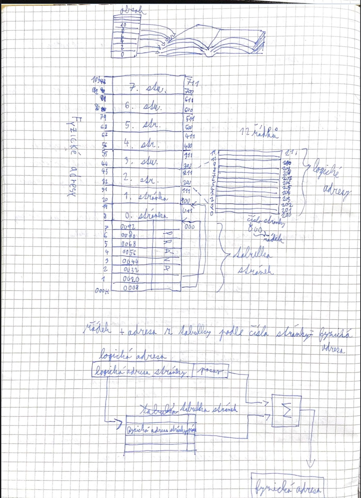
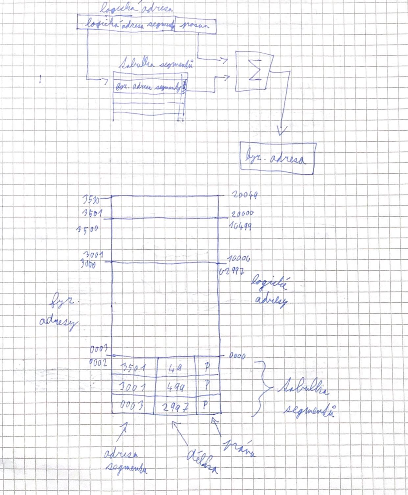
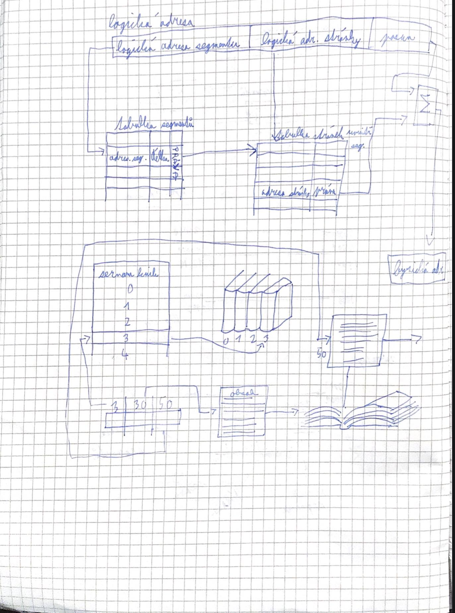
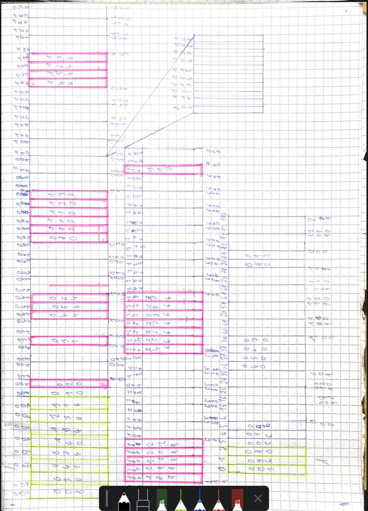

# Stránkování
- stránka
    - pevně daný blok paměti s přesným počtem řádků
    - délka stránky se nemění

# Segmentace

# Stránkování a segmentace

# Reálný a chráněný režim
## Reálný mód
- neboli režim reálných adres
- Základní režim mikroprocesorů x86
- v tomto modu pracuje BIOS, DOS, Microsoft Windows 1
## Chráněný režim
- operační režim mikroprocesorů
- umožňuje v počítači, že program nemůže zasahovat mimo svůj vymezený prostor
- Většina OS používá chráněný režim a zapínají ho od startu jádra operačního systému

## Adresace
- adressa je v režimu reálných adres určena dvěma registry
    - segmentovým
    - offsetovým
- fyzická adresa je vypočítána jako součet hodnoty v segmentovém registru vynásobené 16 a hodnoty v offsetovém registru
