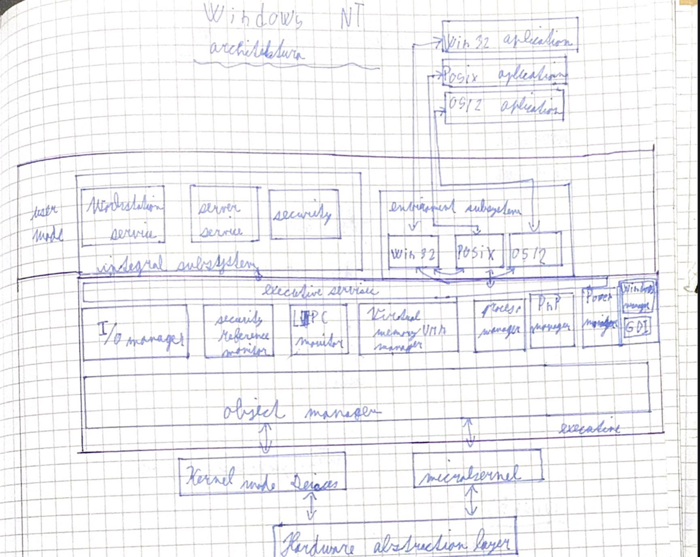
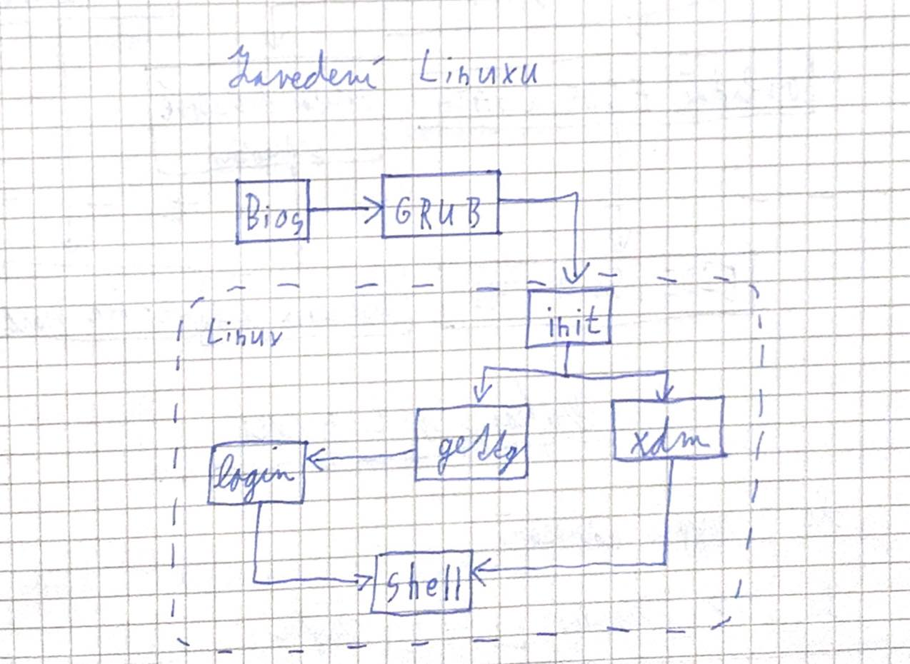

# Struktura OS
## MS DOS
- Microsoft system disk operating system
- Microsoft koupil za 75 000 dolarů od firmy Digital Research systém QDOS
  - **Quick and dirty operating system**
  - vytvořený v roce 1980
  - založený na Operačním systému **CP/M** od Tima Patersona
- Firma IBM ho dodávala pro IBM PC 5150 jako jeden ze 3 dostupných systémů
- MS DOS má **monolitické** jádro
  - druh jádra operačního systému, jehož veškerý kód běží ve stejném paměťovém prostoru (kernel)
- Po roce 1995 byl vytlačen graficky vyspělejším systémem **Windows**
- Microsoft ve spolupráci zveřejnil zdrojové kódy.
- Jednouživatelský, jednoprocesorový a jednoprogramový systém
- volně šiřitelný freedos
### Zavedení systému

- na prvním sektoru pevného disku je umíštěn zaváděč
  - ten hledá soubor **MSDOS.sys** a **IO.sys**
    - když nenajde - chybová hláška
  - uloží ho do operační paměti a předá řízení IO.sys
  - **IO.sys**
    - nadstavba biosu, má 3 funkce
      - obsluha přídavných zařízení
      - správa paměti
      - přesměrování provozu do IO.sys
  - spustí COMMAND.COM
    - zajišťuje komunikaci s uživatelem a OS
    - umožňuje spouštění souborů
  ### Interní příkazy
- ping
  - Zajištění dostupnosti pomocí IP adresy
  - ping 0.0.0.0 -t(počet) -L(délka paketu -32)
- tree
    - Stromová struktura adresářů
- help
- start
- exit
- del
  - maže soubor
- cd
  - change directory
  - cd .. - o adresář výšše
- dir
  - vypíše obsah adresáře
  - /p
  - /W - vypíše do sloupců
- md
  - mkdir - vytvoří adresář
- rd
  - rmdir - smaže adresář
- copy
  - copy odkud kam
- ren
  - ren co naco
- move
  - move odkud kam
## Windows

### Windows NT

## Linux

### CORE

