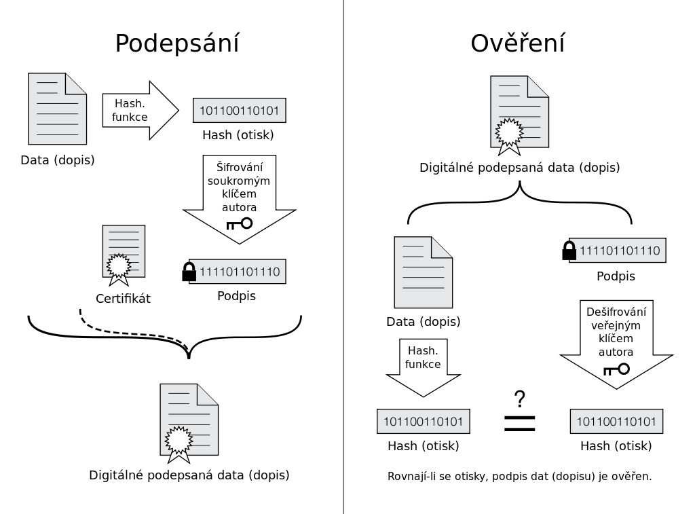

# elektronický podpis

- asymetrická kryptografie
    - hash
    - stále čitelný
- moje datová schránka
- czech point 

# Elektronický podpis
- Označují specifická data a nahrazují klasický vlastnoruční podpis
    - respektivě ověřený podpis
- Je připojen k datové zprávě
    - umožňuje ověření totožnosti podepsané osoby ve vztahu k datové zprávě
- Je vytvořen pro specifická data a je možné je pomocí počítače ověřit, zda je platný a zda jsou data v té podobě jaké byla podepsána
- Součástí podpisu je identifikace toho, kdo podpis vytvořil
- Zahrnuje matematické operace i přenos důvěryhodné třetí strany na tvůrce podpisu
- Digitální certifikát, který se k tomu využívá je vydán **certifikační autoritou** nebo sítí důvěry
- V ČR existuje několik kvalifikovaných poskytovatelů služeb vytvářejících důvěru
## Vlastnosti
- **Autenticita**
    - znamená možnosti ověření identity subjektu, které patří podpis
    - je realizována pomocé přenosu důvěry
- **Integrita**
    - Pomocí integrity lze dokázat, že od vytvoření elektronického podpisu nedošlo ke změně v dokumentu
    - není úmyslně ani neúmyslně poškozen
- **Nepopíratelnost**
    - Autor nemůže tvrdit, že elekronický podpis příslušný k dokumentu nevytvořil
    - k vytvoření je potřeba privátní klíč, který je svázán s veřejným klíčem
        - pomocí kterého dochází k matematickému ověření podpisu
        - bez privátního klíče nelze podpis vyvořit 
        - ověření může proběhnout pouze pomocí veřejného klíče
- **Časové ukotvení**
    - podpis může obsahovat časové razítko, které prokazuje datum a čas podepsání dokumentu
    - časové razítko vydává důvěryhodná třetí strana
## Princip funkce

- Probíhá takzvaná asynchronická kryptografie
    - pomocí hash funkce
- hash funguje pouze jednosměrně
    - nemůžeme data nikdy obnovit, ale pouze ověřit, že jsou pravá
## Poskytovatelé
- Podle zákona je touto stranou poskytovatel certifikačních služeb
    - je to právní subjekt
- **Akreditované certifikační autority**
    - subjekty mají pro nás největší význam
    - zaručuje velice dobrou bezpečnost
- **Veřejné CA**
    - Spadají autority, které nemají akreditaci
    - CA Czechia
    - ZONER software
- **Soukromé CA**
    - soukromých CA existují stovky v ČR
    - může to být každý kdo má know how
    - webhosting, univerzity, velké podniky
## Využití
- Přiznání DPH
- OSVČ přehled o přijmech a výdajích
- podpis PDF
- datové schránky
- elekronické komunikace se státní správou, pojišťovnou
- žádost o dotace EU