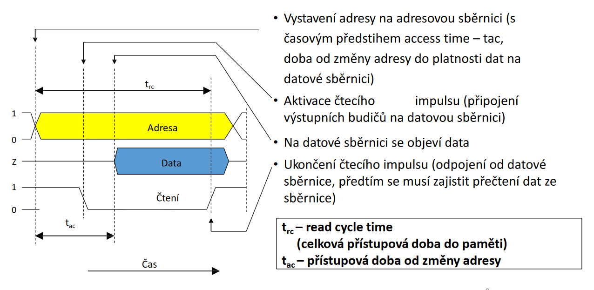
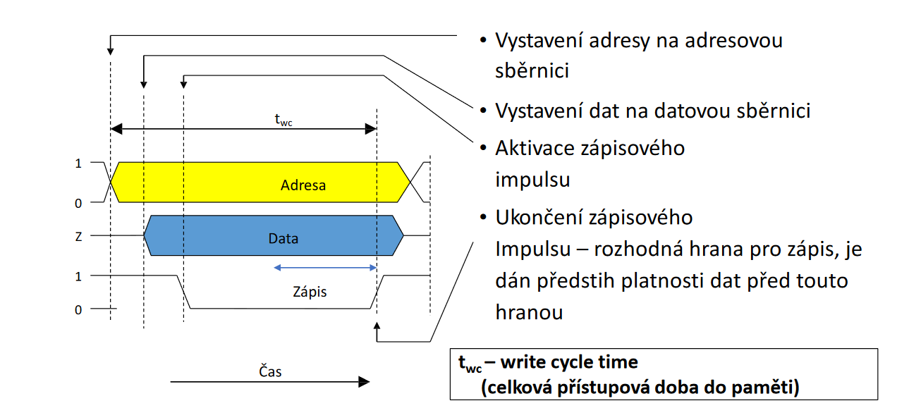
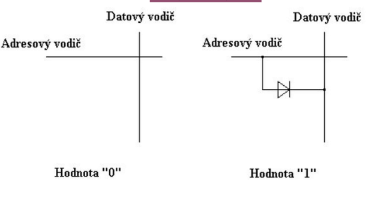
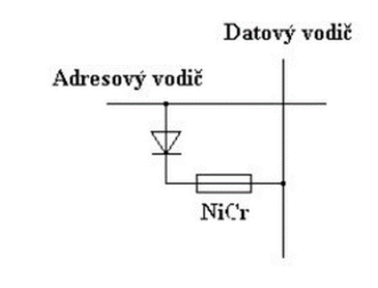
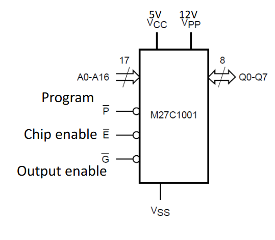

# Paměti
## rozdělení
- dělíme je podle toho, zda po vypnutí napájení se uchovají data či nikoliv
    - **volatilní**
        - při vypnutí se informace smaže
        - RAM
    - **nevolatilní**
        - informace vydrží i po vypnutí
        - magnetické pásky
        - feritové a bubnové paměti
## Čtení z paměti

## Zápis do paměti

# Druhy pamětí
## Paměť RAM
- Random access memory
- označení pro polovodičové paměti s přímým přístupem umožňující čtení a zápis
- poskytuje téměr okamžitý zápis i čtení z jakékoliv jednotlivé paměťové buňky
    - díky této vlastnosti se používají jako operační paměti v PC
        - jsou zde uloženy běžící programy a jejich data a jsou rychle přístupná
- RAM po odpojení ztratí všechny data
- Cena za bit je dražší než pevný disk
### Elektrotechnické vlastnosti
- Díky nízké ceně a vyšší kapacitě se používají dynamické paměti
    - informace je uchována v podobě elektrického náboje v kondenzátoru
    - je nutné je kvůli tomu obnovovat
- Pamět musí být neustále napájena a musí být neustále v činnosti obvod, který ji pravidelně obnovuje
### rozdělení
- dělí se podle technologie, kterou používáme
    - **Statické**
        - paměťová buňka je realizována jako bistabilní klopný obvod
        - CMOS technologie má téměř ideální vlastnosti
            - minimální příkon
            - velkou šumovou odolnost
            - krátkou přístupovou dobu
        - paměťová buňka se ale skládá z 6 tranzistorů
            - vyšší cena za bit než dynamická  
    
    
    - **Dynamické**
    - je levnější a mnohem jednodušší
    - buňky jsou realizovány jedním tranzistorem
    - musí se ale často obnovovat
        - obnova probíhá po celých řádcích
        - pokles výkonu je minimální
            - při obnově je paměť nedostupná
    - při čtení dochází k vymazání buňky
        - obnova musí probíhat při každém čtení
        - čtení je 1,5x delší než zápis
    - uchování informace probíhá v nabíjení kondenzátoru
        - Mullerova kapacita
### dělení modulů
- SDR
    - single data rate
    - jedna hrana clock signalu
- DDR
    - double data rate
    - DDR2, DDR3, DDR4
        - 2 krát rychlejší
        - double protože bere obě hrany clock signalu

## Paměť ROM
- tato paměť je pouze čitelná ale nelze do ní zapisovat
- je nevolatilní
- používá se pro uložení firmware
    - dříve používano pro bios
        - dnes výjímečně protože nelze bios aktualizovat
- Obsah je do paměti uložen při výrobě
    - buď maskou nebo jednorázově naprogramovat
        - přepálení propojek
    - pokud je v paměti chyba je nepoužitelná

    
### Paměť PROM
- programmable read only
- elektricky jednorázově programovatelná
- pokud jsme chtěli zápis 0 do buňky, museli jsme přepálit pojistku **NiCr**

### Paměť EPROM
- Erasable Programmable read only
- historicky první semipermanentní typ paměti typu ROM
- obsah je mazatelný UV zářením
- k programování se používá většinou několikanásobně vyšší napětí než ke čtení
    - typicky 12V nebo 25V proti 5V napájecího napětí

### Paměť EEPROM
- electrically erasable programmable read only
- elektricky mazatelnou nevolatilní paměť typu ROM
- omezenější počet zápisů než paměť typu FLASH
- před novým naprogramováním je nutné smazat elektrickým signálem celý obsah
- **zapis**
    - na adresový vodič se přivede záporné napětí
    - datový vodič buňěk, do niž se zaznaménává hodnota 1 se uzemní
    - tranzistor se otevře a vznikne náboj, který vytvoří velké prahové napětí
    - smazaní proběhne když na adresový vodič se přívede +U
## Flash paměť
- nevolatilní
- elektricky programovatelná s libovolným přístupem
- organizována po blocích
- narozdíl od EEPROM lze programovat každý blok samostatně
    - ostatní bloky jsou zachovány
### Elektrotechnika
- data jsou ukládána pomocí unipolárních tranzistorů s plovoucími hradly
- každý z nich obvykle uchovává 1 bit 