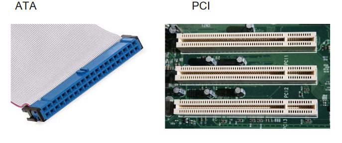

# Komunikační rozhraní 
## HW paralerní a seriová rozhraní
- komunikační rozhraní umožňuje přenos informací mezi komunikačními subjekty
- propojení chytrého telefonu a  počítače může být zajištěno například USB rozhraním
- v oblasti software interface slouží  k usnadnění a sjednocení komunikace v rámci programu
- Samotný přenost dat u paraleního rozhraní využívá tolik vodičů, kolik bitů využívá daná sběrnice
	- typicky 8/16/32/64 bitů
- Seriový přenos využívá jedné linky

### Sběrnice
- soustava vodičů zajišťujících přenos signálů a dat mezi připonenými členy
- šířka přenosu
	- počet bitů, které lze zároveň přenést po sběrnici
- frekvence
- rychlost a propustnost
- možnosti připojení zařízení
### Paralelní rozhraní
- vyšší náklady a složitost na výrobu oproti sérii
- na delší vzdálenosti neni vhodný kvůli technickému mezení
	- mohou se objevovat chyby
	- rozdílné paramatry v obvodech
		- délka, izolace, spoje atd.

### Sériová rozhraní

# Jednotlivé rozhraní
## USB
- UNIVERSAL SERIAL BUS
- univerzální sériová sbernice
	- moderní způsob připojení periferií k PC
- Nahrazuje PS/2, gameport
- Plug and Play
	- možnost připojení periférie bez nutnosti resetování zařízení
	- Průběh:
		- Hub informuje o přítomnosti nového zařízení
		- PC se dotáže  hubu, na který port bylo připojeno
		- Po odpovědi pc vydá příkaz tento port zapnout a resetuje sběrnici
		- Hub vyrobí reset signál o délce 10 ms. Uvolní pro zařízení proud 100mA.
		-  Hostitel přečte první bajty popisovače zařízení aby stanovil jakou délku mohou mít pakety
		- hostitel přiřadí adresu na sběrnici
		- hostitel si načte konfiguraci
		- Je připraven k použití
- Jsou různé typy konektorů
	- USB A
	- USB B
	- USB C
	- USB Micro A/B
	- poskytuje napětí 5 V
- zapojení
	- dvojice datových vodičů
		- DATA+
		- DATA-
		- standartně zelený a bílý vodiče
		- je kroucená
	- VCC, 5V červený
	- GROUND
	- těsněn v hlíníkové folii
## RS-232
- sériový port se používá jako komunikační rozhraní osobních počítačů
- dnes se od portu odstoupilo

