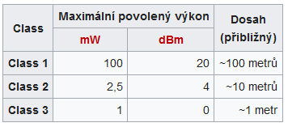
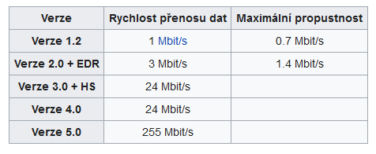
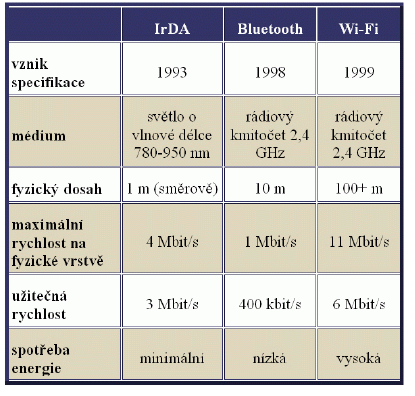

# Bezdrátová přenosová média
- Spočívá ve spojení dvou subjektů jiným způsobem než mechanicky
- Oficiálně je objevitelem Nikola Tesla
- **Typy**
    - Optická
        - infračervené spoje - čidla
    - Rádiová
        - WiFi, Bluetooth
        - vysílačky, televizní přenos
    - Sonická
        - verbální komunikace
## WiFi
- WiFi je označení pro několik standardů popisujících bezdrátovou komunikaci v sítích
- Tato technologie využívá "Bezlicenčního frekvenčního pásma" proto je ideální pro budování levné, ale výkonné infrastruktury bez nutnosti kabelů
    - Ke každé bezdrátové síti musí mít provozovatel od státu licenci pro vysílání v určité frekvenci
        - je omezené množství frekvencí
        - Stát je za velké částky pronajímá a následně chrání
    - Některé frekvence jsou ale pohlcovány při dešti (Mikrovlnka)
        - Stát je uvolnil pro průmyslové, vedecké a lékařské užití. Je však nutné dodržovat podmínky Českého telekomunikačního úřadu
    - z počátku je využívali výrobci různými technologiemi, ale poté doško k sjednocení
- ZAJÍMAVOST WiFi původně neznamenalo nic
    - lidé to nazývali "Wireless fidelity" (vysoká věrnost) podle zkratky Hi-Fi
- Původně bylo cílem zajišťovat vzájemné bezdrátové přenosných zařízení a dále jejich připojování na lokální síti LAN.
### Struktura
- Je třeba určit identifikátor SSID (Service Set Identifier)
    - řetězec 32 ASCII znaků
    - je v pravidelných intervalech vysílán jako broadcast. Aby bylo možné se připojit
- velkou roli hraje zabezpečení
    - Můžeme zamezit vysílání SSID
    - Kontrolovat MAC adresy (blacklist, whitelist)
    - WEP
        - Šifrování komunikace pomocí statických klíčů symetrické šifry
        - jednoduché dešifrovat
        - Algoritmus CRC-32
    - WPA
        - používá také WEP klíče ale jsou dynamické
        - používá algoritmus MAC(Message Authentication code) neboli Michael
        - Obsahuje počítadlo aby někdo nemohl odposlouchat komunikaci a zopakovat
## Standard WiFi
- Standardy 802.11 zahrnuje několik druhů modulací
- IEEE 802.11 je standard pro bezdrátové lokální sítě
- používají se písmena pro různá pásma a rychlosti

- Certifikační proces deklarovaný logem WiFi Alliance zaručuje zpětnou kompabilitu se staršími zařízeními
### IEEE 802.11a (WiFi 1)
- Tento standard využívá WiFi v pásmu 5GHz
- Jedná se o stabilnější a vyspělejší verzi než g nebo b.
- Lze ho používat na větší vzdálenosti
### IEEE 802.11b
- Navyšuje rychlost na 11Mbit/s
### IEEE 802.11g
- Rozšiřuje IEEE 802.11b
- Je zpětně kompatibilní
- 2,4GHz s rychlostí 54Mbit/s
### IEEE 802.11ac
- Technologie OFDM  a MU-MIMO
## CSMA/CA
- Carrier Sense Multiple Acces with Collision Avoidance
- Protokol pro metody s vícenásobným přístupem
- Podobný jako CSMA/CD což je pro half duplex sítě
- Zařízení poslouchá, jestli probíhá přenos
    - pokud probíhá, počká krátkou dobu a začne znovu
- pokud neprobíhá počká náhodnou krátkou dobu a začne posílat data
- zařízení co příjmá data musí odpovědět, že data dorazila, pokud ne. Proces se bude opakovat
- používá se u bezdrátových sítí
- je možné použít dodatečný protokol **RTS/CTS**
    - Ready to send, clear to send
    - pokud probíhá provoz, zařízení pošle přístupovému bodu RTS
        - požádá o přenos dat
    - WAP může odpovědět CTS zprávou (Clear to send) a zastaví ostatní komunikaci
    - po obdržení této zprávy začne zařízení vysílat
## Bluetooth
- je to otevřený standard pro bezdrátovou komunikaci propojující dvě nebo více zařízení
- Byl vytvořen v roce 1994 firmou Ericsson jako bezdrátovou náhradu za RS-232
- Je definována standardem IEEE 802.15.1
- Spadá do Personal Area Network

- Pracuje v ISM pásmu 2,4GHz přenosu využívá metody FHSS kdy během sekundy je provedeno 1600 skoků mezi 79 frekvencemi s rozestupem 1MHz
    - aby se zamezilo rušení
- Bluetooth je vydáváno ve verzích kdy nejpoužívanější je 2.0
    - Nové bluetooth podporuje vysoký dosah, šifrování AES-128 a menší spotřebu
- Používá Párovací mechanismy pro propojení
    - Dedičné párování
        - Musí se zadat pin na obou zařízení a musí se shodovat
        - Bluetooth 2.0 a starší
    - Jednoduché bezpečné párování
        - Používá kryptografii s veřejným klíčem

## IR spoje
- Výborně fungují ve venkovním prostoru
- Nejčastější využití je pro dálkové ovládání TV
- Existují dvě možnosti využití záření
    - přímo jsou koncentrované paprsky namířeny na přímač
    - rozptýleně, kdy se od stěn dostanou k cíli
- **IrDA**
    - průmyslové sdružení zabývající se specifikací protokolů pro infračervenou komunikaci
    - První specifikace IrDA vznikla 1993 jako náhrada kabelů, ale vyvinuly se i další normy pro bezdrátovou komunikaci
        - IrOBEX pro výměnu vizitek, záznamů v kalendáři a dalších objektů
- **Infračervený vysílač** je dioda pracující na pásmu 780-950 nm. Intenzita je omezena předpisy pro bezpečnost očí
- má vetší šířku pásma než rádiová komunikace
### Protokolová architektura
- IrPHY
    - fyzický protokol
- IrLAP
    - navazuje spolehlivé spojení, založený na HDLC
- IrLMP
    - multiplexuje službu a aplikace na spojení LAP
